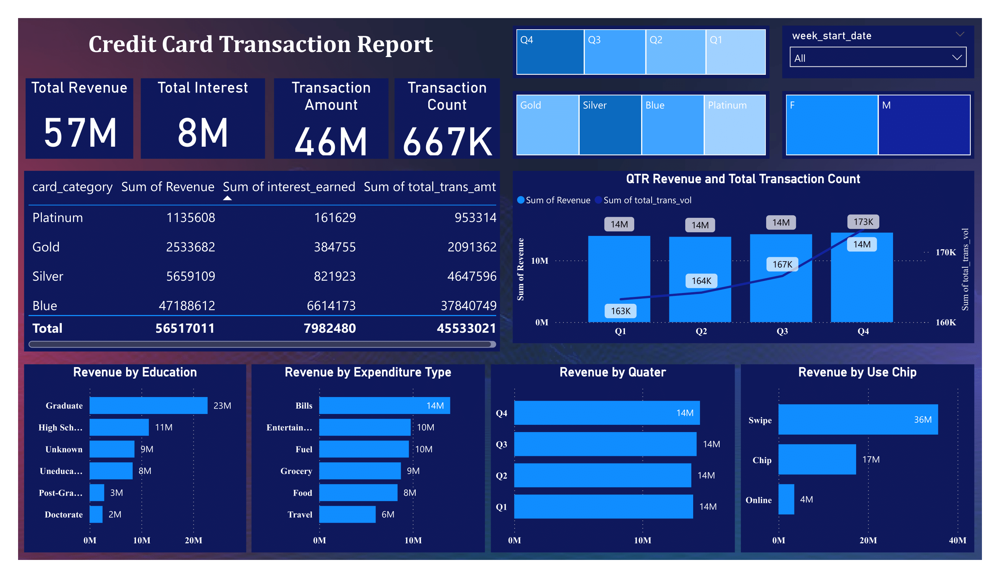

# Weekly Credit Card Financial Dashboard

This project is a weekly performance dashboard designed for the ongoing analysis of credit card transactions and customer data. It provides at-a-glance metrics and key performance indicators (KPIs) to track business health and inform strategic decisions on a recurring basis.

---

## 🛠️ Tech Stack

* **Database:** PostgreSQL
* **Data Ingestion:** SQL
* **Data Modeling & Analytics:** DAX (Data Analysis Expressions)
* **Data Visualization:** Power BI / Tableau

---

## ⚙️ Project Workflow

The dashboard's data pipeline is structured to handle weekly updates:

1.  **Initial Data Setup (SQL):** The initial database schema was created using SQL. The `COPY` command was then used to ingest the foundational dataset from the original CSV files (`credit_card.csv`, `customer.csv`).
2.  **Live Performance Simulation:** To demonstrate the dashboard's capability for live tracking, new weekly data was programmatically added to the database. This simulates a real-world scenario where new transactions and customer information are continuously fed into the system.
3.  **Dynamic Modeling (DAX):** The data was modeled in Power BI. DAX was crucial for creating time-intelligence calculations essential for a weekly report, such as **Week-over-Week (WoW) growth** and other dynamic measures.
4.  **Dashboard Visualization:** An interactive dashboard was built to present the weekly findings, allowing stakeholders to easily monitor performance and drill down into specific metrics.

---

## 📊 Key Performance Indicators & Insights

This analysis has uncovered several critical insights into customer behavior and business performance.

### Overall Performance (Year-to-Date)

* **Total Revenue:** The portfolio generated **$57 Million** in total revenue.
* **Total Interest Generated:** A significant **$8 Million** was earned in interest.
* **Total Transaction Value:** Customers collectively spent **$46 Million** across all transactions.
* **Weekly Growth:** The most recent week showed a strong upward trend with a **28.8% increase in revenue** week-over-week.

### Customer Demographics Insights 🧑‍🤝‍🧑

* **Top Earners by Education:** Customers with a **Graduate degree** are the most valuable segment, contributing **$23M** to revenue more than double the next highest group (High School graduates at $11M).
* **Most Lucrative Profession:** **Businessmen** are the highest-revenue customer group, generating over **$17.6M**.
* **Gender Spending Patterns:** Male customers are the primary revenue drivers, contributing **$31M**, compared to **$26M** from female customers.

### Geographic Performance 🌍

* **Key Revenue-Driving States:** A remarkable **68%** of total revenue originates from just three states: **Texas (TX), New York (NY), and California (CA)**.

### Product & Transaction Insights 💳

* **Core Card Categories:** The **Blue and Silver cards** are the backbone of the portfolio, driving a combined **93%** of the total transaction value. The Blue card is the standout performer, single-handedly accounting for **$47.2M** in revenue.
* **Top Spending Category:** **Bill payments** represent the largest portion of customer spending, generating **$14M** in revenue.
* **Dominant Transaction Method:** **Chip-based payments** are the most popular method, accounting for **$36M** in revenue.
